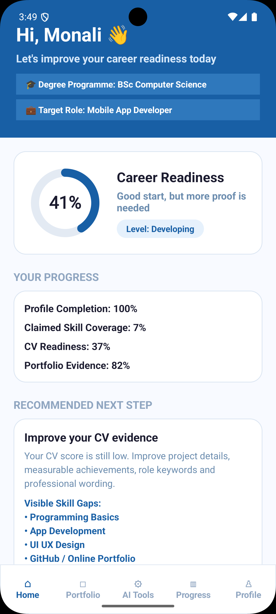
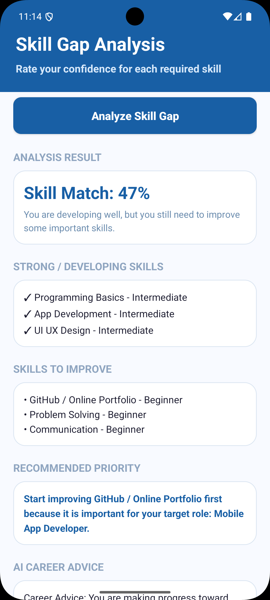
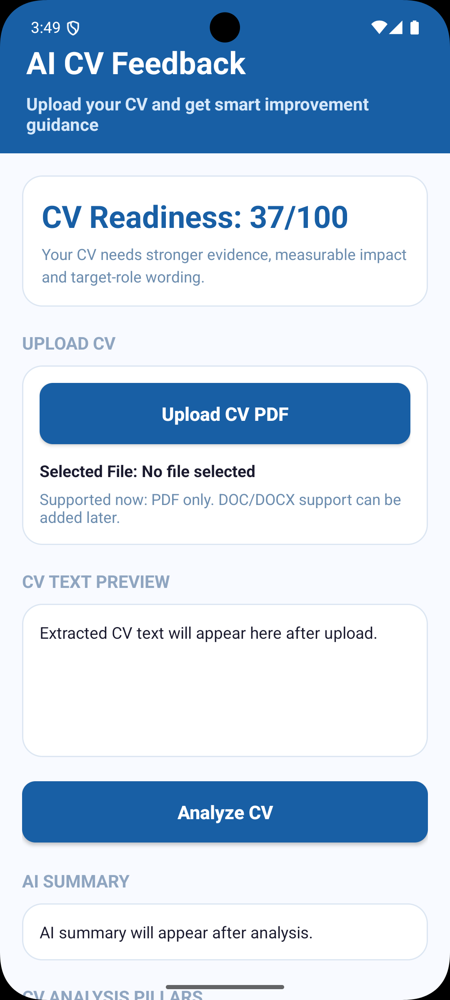
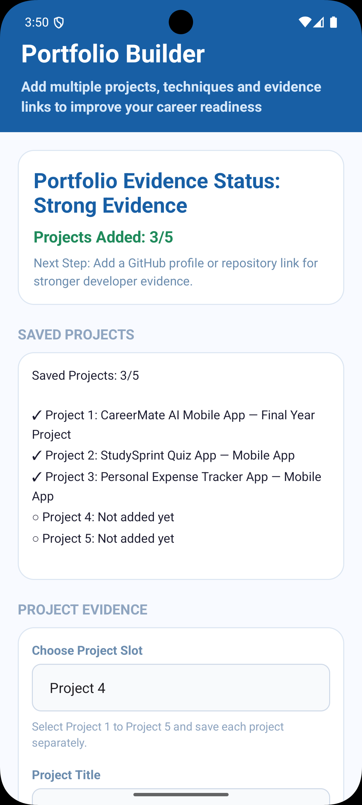
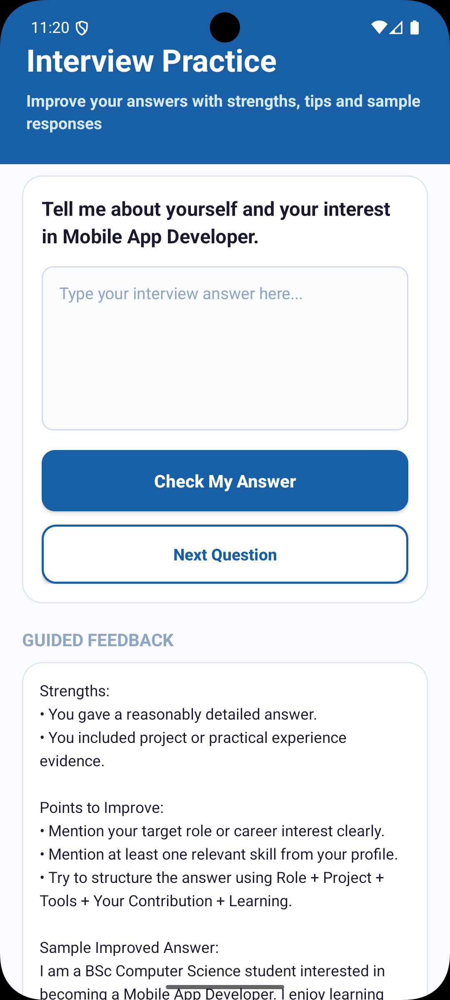
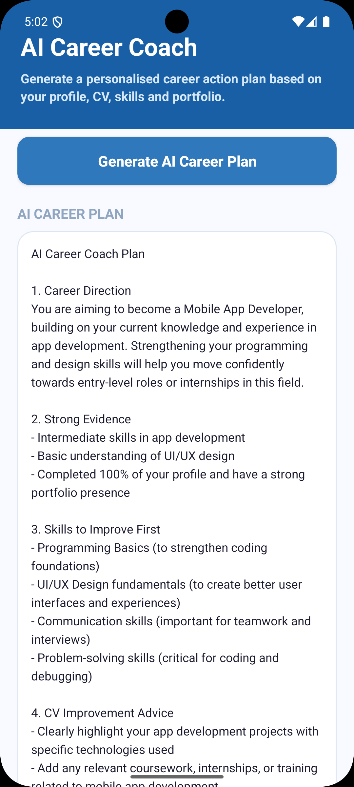

# CareerMate AI

### AI-Powered Student Career & Portfolio Assistant

CareerMate AI is an Android career-support application designed to help university students and recent graduates understand and improve their career readiness through one connected mobile platform.

The project brings together career profiling, skill-gap analysis, CV feedback, portfolio development, interview practice, career recommendations, readiness monitoring and personalised AI-supported career guidance.

> **Current Stage:** Working pre-release Android prototype

---

## Problem

Students often depend on separate tools for CV preparation, skills assessment, portfolio development, interview practice and career guidance. This fragmented approach can make it difficult to understand overall career readiness and identify the most useful next steps.

CareerMate AI was developed to provide these activities within one structured and personalised application.

---

## Key Features

* **Career Profile** — Records academic background, target career role and selected skills.
* **Career Readiness Dashboard** — Displays an evidence-based readiness score and recommended next steps.
* **Skill Gap Analysis** — Compares selected skills with requirements for the user's target role.
* **CV Feedback** — Reviews uploaded CV PDFs using structured assessment rules.
* **Portfolio Builder** — Allows users to record projects as evidence of practical skills and achievements.
* **Interview Practice** — Provides role-relevant questions and structured feedback.
* **Career Recommendations** — Suggests suitable career directions using profile and readiness information.
* **AI Career Coach** — Generates a personalised career action plan from selected readiness indicators.

---

## Technology Stack

* Java
* XML
* Android Studio
* Firebase Authentication
* Cloud Firestore
* Firebase Cloud Functions
* Firebase App Distribution
* PDFBox for Android
* OpenAI Responses API

---

## Responsible AI and Explainable Assessment

CareerMate AI separates core assessment logic from generative AI.

Career-readiness and related assessment features use transparent rule-based logic, evidence requirements and score caps. Generative AI is limited to the AI Career Coach, where it transforms selected readiness information into practical career-development guidance.

AI-generated guidance is advisory and does not represent a verified prediction of employability or employment success.

---

## Secure AI Integration

The AI Career Coach follows a protected backend workflow:

**Android Application → Data Minimisation → Authenticated Firebase Cloud Function → OpenAI Responses API → Response Validation → CareerMate AI**

Key security decisions include:

* The OpenAI API credential is not stored inside the Android application.
* AI requests are routed through an authenticated Firebase Cloud Function.
* Only necessary career-related information is included in AI requests.
* Original CV files are not sent to the external AI service.
* Generated career plans may be stored under the authenticated user's Firestore record.

---

## Testing and Development Improvements

CareerMate AI has been tested using both the Android emulator and physical Android devices.

Important issues identified and corrected during development include:

* **Portfolio persistence:** Portfolio data was migrated from local-only storage to user-specific Cloud Firestore storage.
* **CV document validation:** Validation rules were strengthened after an unrelated university presentation PDF was incorrectly accepted as a CV.
* **Profile and skill persistence:** User-data retrieval was corrected to retain profile and skill information across sessions.

A signed Android APK has also been distributed to invited reviewers through Firebase App Distribution for pre-release testing.

---

## Screenshots

<table>
  <tr>
    <td align="center">
      <strong>Career Readiness Dashboard</strong>  
      
    </td>
    <td align="center">
      <strong>Skill Gap Analysis</strong>  
      
    </td>
    <td align="center">
      <strong>CV Feedback</strong>  
      
    </td>
  </tr>
  <tr>
    <td align="center">
      <strong>Portfolio Builder</strong>  
      
    </td>
    <td align="center">
      <strong>Interview Practice</strong>  
      
    </td>
    <td align="center">
      <strong>AI Career Coach</strong>  
      
    </td>
  </tr>
</table>
---

## Project Status

CareerMate AI is currently a **working pre-release prototype** developed as a BSc (Hons) Computer Science final-year project.

Future development will focus on:

* Broader participant testing
* Career-adviser validation
* Expanded career-role datasets
* Improved application architecture
* Institutional-scale evaluation

No commercial launch or large-scale institutional adoption is currently claimed.

---

## Security and Configuration

Sensitive configuration files and credentials are intentionally excluded from this public repository.

The repository does **not** include:

* OpenAI API credentials
* Firebase environment secrets
* `google-services.json`
* Local Android SDK configuration
* Signing keys
* Generated release APK/AAB files

Developers wishing to run the project must configure their own Firebase project and required backend credentials.

---

## Author

**Monali Pabasara**
BSc (Hons) Computer Science
Singapore

CareerMate AI was researched, designed, implemented and tested as a final-year technology project focused on responsible and accessible student career support.
